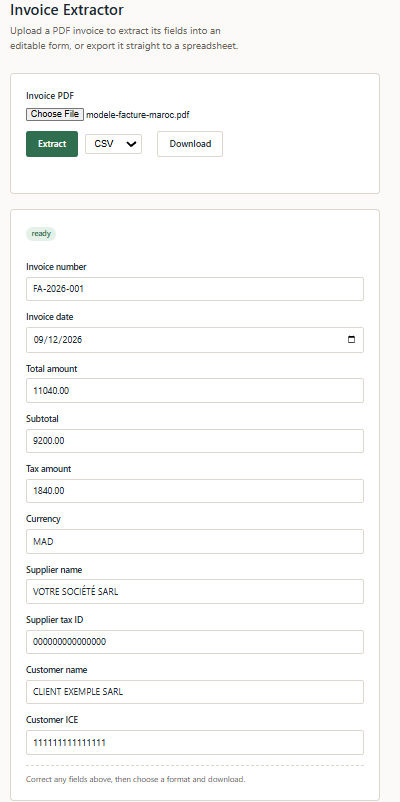
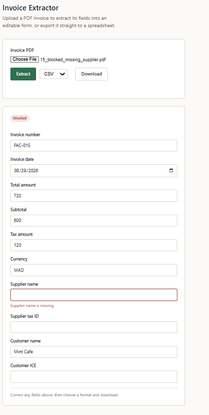
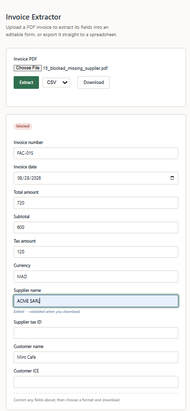

# Invoice Extractor


## Live Demo

Try the deployed application:

**[Open Invoice Extractor](https://invoice-extractor-b1gp.onrender.com/)**

> The demo runs on a free hosting tier, so the first request may take a short time while the service wakes up.

## Overview

A Python/FastAPI application that extracts structured invoice data from PDF invoices using deterministic extraction. Missing or ambiguous information is surfaced for human review rather than silently guessed, allowing users to correct and confirm extracted data before export. The current MVP focuses on text-based Moroccan invoice formats in French and English.

## Demo

The application extracts structured invoice data, surfaces uncertain or missing information for human review, and exports the corrected result to CSV or Excel.

### Successful extraction

A supported invoice is extracted successfully and classified as `ready`.



### Human review

When a required field cannot be extracted reliably, the invoice is classified as `blocked` rather than silently guessing a value.



### Correction before export

The user can correct the extracted data directly in the browser. Corrected values are validated when the invoice is exported.



## Features
- PDF upload and text extraction
- French and English invoice field extraction
- Supplier and customer information extraction
- Moroccan ICE and tax ID extraction
- Subtotal, tax, and total amount extraction
- Currency detection and conflict handling
- Validation of required fields and invoice totals
- Review statuses: `ready`, `needs_review`, and `blocked`
- User correction and confirmation before export
- CSV and Excel export
- Automated test suite

## Demo Workflow

1. **Upload** — The user selects and uploads a text-based PDF invoice.

2. **Extraction** — The backend reads the PDF text and runs deterministic extractors for invoice number, date, supplier and customer information, tax IDs, amounts, and currency.

3. **Review** — `review_invoice()` checks the extracted data against required fields and business rules. Missing required fields can block the invoice, while issues such as conflicting tax IDs or inconsistent totals can require manual review. The result is classified as `ready`, `needs_review`, or `blocked`.

4. **Editable form** — The browser displays the extracted fields as editable inputs and surfaces errors or warnings next to fields that require attention.

5. **User correction** — The user reviews the extracted information and corrects missing or inaccurate values. For example, if `supplier_name` cannot be extracted, the invoice is blocked until the user supplies the missing value.

6. **Validation on export** — Clicking Download sends the edited structured data to `/export`. The original PDF is not re-extracted. The submitted data is validated again using the strict `InvoiceData` model and export validation rules.

7. **Download** — Once validation succeeds, the application generates a CSV or Excel file from the corrected data and returns it for download.

## Architecture

The application is organized by responsibility so that extraction, validation, API handling, and export logic remain independent and testable.

```text
app/
├── pdf.py            # PDF validation and text extraction
├── config.py         # Environment-based application configuration
├── logging_config.py # Application logging configuration
├── fields.py         # Invoice number, invoice date, and currency extraction
├── amounts.py        # Amount normalization and subtotal/tax/total extraction
├── parties.py        # Supplier and customer name extraction
├── tax_ids.py        # Party-aware ICE / IF / tax identifier extraction
├── models.py         # Domain models and extraction/review result types
├── pipeline.py       # Coordinates field extractors into an ExtractionResult
├── review.py         # Validation, review classification, and finalization
├── exporters.py      # CSV and Excel generation
├── main.py           # FastAPI endpoints and HTTP orchestration
└── static/
    └── index.html    # Browser-based review and correction interface
```
The extraction and review flow is:
```text
PDF
 │
 ▼
pdf.py
 │
 ▼
┌─────────────────────────────────────────────┐
│             Deterministic Extraction        │
│                                             │
│ fields.py  amounts.py  parties.py tax_ids.py│
└──────────────────────┬──────────────────────┘
                       │
                       ▼
                   pipeline.py
                       │
                 ExtractionResult
                       │
                       ▼
                    review.py
                       │
          ┌────────────┼────────────┐
          ▼            ▼            ▼
        ready     needs_review     blocked
          └────────────┼────────────┘
                       ▼
                Human correction
                       │
                       ▼
                Export validation
                       │
                       ▼
                  exporters.py
                    /       \
                   ▼         ▼
                  CSV       Excel
```

## Supported Invoice Fields

| Field | Type | Required | Description |
|---|---|---|---|
| `invoice_number` | String | Yes | Reference that uniquely identifies the invoice |
| `invoice_date` | Date | Yes | Date the invoice was issued |
| `supplier_name` | String | Yes | Name of the supplier or issuing company |
| `supplier_tax_id` | String | No | Supplier tax identification number |
| `customer_name` | String | No | Name of the customer receiving the invoice |
| `customer_ICE` | String | No | Customer ICE number |
| `subtotal` | Decimal | No | Amount before tax |
| `tax_amount` | Decimal | No | Tax amount |
| `total_amount` | Decimal | Yes | Final invoice amount including tax |
| `currency` | String | Yes | Currency used for the invoice amounts |


## Validation & Human Review

### `ready`

All required information was extracted successfully with no review issues detected.

### `needs_review`

Required invoice information was extracted successfully, but one or more issues deserve human review, such as inconsistent totals, an invalid customer ICE, or conflicting tax-ID candidates.

### `blocked`

One or more required fields are missing, or a blocking ambiguity prevents the invoice from being considered ready, such as conflicting currency detection.

Users can review and correct the extracted fields directly in the browser. Before a file is generated, the corrected data is validated again to ensure that the exported CSV or Excel file contains valid, user-confirmed information.

## API

### `POST /extract`

Accepts a PDF file upload using `multipart/form-data` with the field name `file` and content type `application/pdf`. The server extracts the PDF text, performs structured field extraction, and runs the result through the review system.

Returns a JSON response containing:

| Field | Description |
|---|---|
| `filename` | Original uploaded filename |
| `status` | Review status: `ready`, `needs_review`, or `blocked` |
| `data` | Extracted invoice fields; fields that could not be extracted are returned as `null` |
| `issues` | List of `{field, code, message, severity}` objects describing detected problems |

### `POST /export`

Accepts the corrected `InvoiceData` as a JSON request body rather than another PDF upload. This is deliberate: after `/extract`, the user can review and correct the structured data in the browser. `/export` generates the file directly from those corrected values without re-uploading or re-parsing the original PDF.

#### Query parameters

| Parameter | Required | Description |
|---|---|---|
| `format` | Yes | Export format: `csv` or `xlsx` |
| `filename` | No | Base filename for the downloaded file, without the extension |

Before generating the file, the submitted data passes through two layers of validation:

1. **Model validation** — `InvoiceData` enforces required fields and field-level rules, including nonblank invoice number and supplier name, and supported currency codes. Invalid request data is rejected before the endpoint's export logic executes.

2. **Business-rule validation** — Additional checks validate customer ICE format and verify that `subtotal + tax_amount = total_amount` when sufficient values are available.

If validation succeeds, the endpoint returns the generated CSV or Excel file as a download.

## Production Hardening

The deployed MVP includes several safeguards and operational features beyond the core extraction workflow:

- Environment-based configuration for deployment settings
- Configurable PDF upload-size limit
- PDF content-type, structure, encryption, and extractable-text validation
- Request IDs and structured application logging for extraction requests
- `/health` endpoint for service health checks
- Temporary export directories cleaned up after successful downloads and export failures
- API validation errors translated into readable frontend messages
- Accessible status announcements and field-level validation relationships
- Responsive browser interface verified at narrow mobile widths

## Installation

### Prerequisites

- Python 3.13+
- `pip`
- Git

### Setup

Clone the repository:

```bash
git clone <repository-url>
cd invoice-extractor
```

Create a virtual environment:

```bash
python -m venv venv
```

Activate it.

On Windows PowerShell:

```powershell
.\venv\Scripts\Activate.ps1
```

On macOS/Linux:
```bash
source venv/bin/activate
```

Install dependencies:


```bash
pip install -r requirements.txt
```

## Running the Application
Start the FastAPI development server:

```bash
python -m uvicorn app.main:app --reload
```
Open the application in your browser at:
```text
http://127.0.0.1:8000
```
FastAPI's interactive API documentation is also available at:
```text
http://127.0.0.1:8000/docs
```

## Running Tests
Run the complete automated test suite with:

```bash
python -m pytest
```

## Validation

The current MVP has been validated through automated tests, synthetic invoice samples, and external Moroccan invoice layouts.

### Automated Tests

The test suite currently contains **187 passing tests** covering:

- Invoice number, date, and currency extraction
- Amount parsing and normalization
- Supplier and customer extraction
- ICE and tax-ID extraction
- Extraction pipeline behavior
- Review and validation rules
- CSV and Excel generation
- FastAPI `/extract` and `/export` endpoints
- Strict `InvoiceData` model validation
- PDF type and upload-size validation
- Environment-based application configuration
- Export temporary-file cleanup on success and failure
- Application health endpoint

### Synthetic Invoice Pack

The extractor was tested against a pack of **20 synthetic Moroccan invoices** containing variations in French and English labels, number formats, party information, tax identifiers, amounts, and currencies.

The expected extraction fields and review statuses matched across the test pack.

### External Invoice Samples

The application was also tested against two independently generated Moroccan invoice layouts that were not designed around the extractor's original test fixtures.

Both were processed successfully through the complete workflow:

```text
PDF upload
    ↓
Text extraction
    ↓
Structured field extraction
    ↓
Review and validation
    ↓
Human-editable structured data
    ↓
CSV / Excel export
```
### Human-Correction Workflow

The review workflow has also been tested with incomplete extraction results. A blocked invoice with a missing required supplier name was corrected through the browser interface and then exported successfully.

The exported file contained the user-corrected structured data, confirming that `/export` operates on the reviewed values rather than silently re-extracting the original PDF.

## Project Structure
```text
invoice-extractor/
├── app/
│   ├── __init__.py
│   ├── pdf.py            # PDF validation and text extraction
│   ├── config.py         # Environment-based application configuration
│   ├── logging_config.py # Application logging configuration
│   ├── fields.py         # Invoice number, date, and currency extraction
│   ├── amounts.py        # Amount normalization and subtotal/tax/total extraction
│   ├── parties.py        # Supplier and customer name extraction
│   ├── tax_ids.py        # Party-aware ICE / IF / tax ID extraction
│   ├── pipeline.py       # Coordinates extractors into an ExtractionResult
│   ├── review.py         # Validation, review classification, and finalization
│   ├── models.py         # Domain models and extraction/review result types
│   ├── exporters.py      # CSV and Excel export
│   ├── main.py           # FastAPI application and HTTP endpoints
│   └── static/
│       └── index.html    # Browser review and correction interface
│
├── tests/
│   ├── test_fields.py
│   ├── test_amounts.py
│   ├── test_parties.py
│   ├── test_tax_ids.py
│   ├── test_models.py
│   ├── test_pipeline.py
│   ├── test_review.py
│   ├── test_exporters.py
│   └── test_api.py
│
├── samples/             # Sample invoices used during development
├── requirements.txt
├── README.md
└── .gitignore
```

## Current Limitations
1. **Text-based PDFs only.** Extraction depends on `pypdf` text extraction. Scanned or image-only invoices without an embedded text layer are not supported because the current MVP does not include OCR.

2. **Deterministic, label-based extraction.** Fields are extracted from flattened PDF text using known labels and contextual rules rather than full visual-layout understanding. Unrecognized invoice layouts may therefore produce missing fields and require manual correction.

3. **French and English invoice labels only.** The current extraction rules target common French and English invoice terminology. Other languages are not currently supported.

4. **Limited currency detection.** The application recognizes a defined set of supported currencies and common representations such as `MAD`, `DH`, `DHS`, `EUR`, and `USD`. Unsupported currency representations may not be detected automatically.

5. **Limited inference from visual position.** Information that appears only through document layout, branding, logos, or letterhead position may not be extracted if there is no usable textual context.

6. **Ambiguous number formats use deterministic conventions.** Values such as `1,234` can represent either a thousands separator or a decimal separator depending on locale. The current parser applies predefined normalization rules rather than attempting probabilistic interpretation.

7. **No persistence.** Extraction and export requests are stateless. Uploaded invoices, extracted values, corrections, and generated exports are not stored for later retrieval.

8. **No authentication or multi-user accounts.** The current MVP does not include users, ownership, roles, or access-control mechanisms.

9. **Single-invoice processing only.** Each extraction request handles one PDF. Batch uploads and bulk exports are not currently supported.

10. **Extraction coverage is not universal.** The application has been tested against multiple Moroccan invoice layouts, but new suppliers and document formats may introduce labels or structures that require additional deterministic extraction rules.

11. **Extraction conflicts are not re-detected during export.** Currency and tax-ID conflicts are detected while interpreting the original invoice text. After the user reviews and replaces those values, `/export` validates the submitted structured data rather than re-processing the original PDF.

## Roadmap

Development will continue to be driven primarily by real invoice samples and observed extraction failures rather than attempting to anticipate every possible invoice format.

1. **OCR fallback for scanned PDFs.** Detect image-only PDFs and route them through OCR instead of rejecting documents without an extractable text layer.

2. **Layout-aware extraction.** Extend the current deterministic approach with document structure and positional information so extraction is less dependent on exact labels in flattened PDF text.

3. **Top-of-document supplier inference.** Add a controlled fallback for identifying supplier names from letterhead and top-of-document context when no explicit supplier label is available.

4. **Broader section-aware party extraction.** Expand the existing contextual tax-ID rules so supplier and customer identifiers can be attributed reliably across a wider range of invoice section layouts.

5. **Broader currency and language support.** Add currencies, terminology, and languages based on real invoice samples and demonstrated requirements.

6. **Persistence.** Store extraction results and user corrections so invoices can be revisited without re-uploading and re-processing the original PDF.

7. **Batch processing.** Support uploading, reviewing, and exporting multiple invoices in a single workflow.

8. **Authentication and per-user data isolation.** Add accounts, ownership, and access control when the application moves beyond its current single-user MVP scope.

9. **Keep review and final validation contracts synchronized.** Ensure hard requirements enforced by the final `InvoiceData` model are also represented by the review layer, with tests preventing the two validation stages from drifting apart.

10. **Configurable validation policies.** Allow organizations to define requirements such as mandatory fields, supported currencies, and tax-ID validation rules once multiple real deployment requirements justify configuration.
